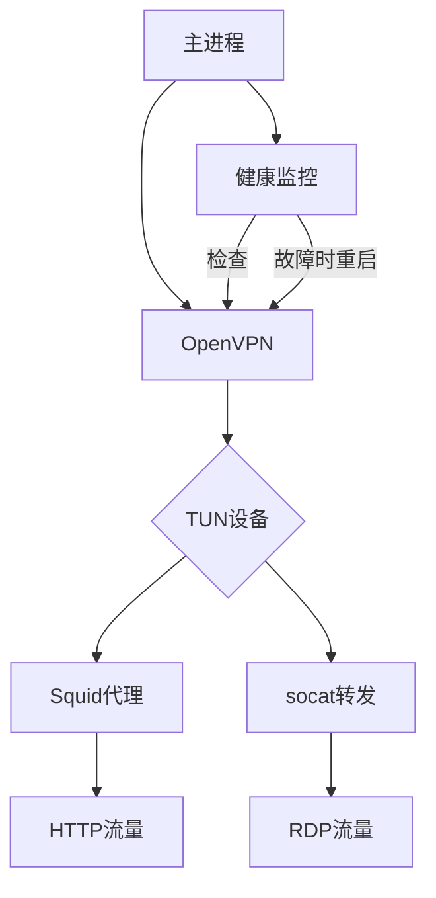

# OpenVPN RDP & HTTP Proxy Docker Image
> Secure tunnel for RDP and HTTP traffic via OpenVPN

将 OpenVPN 打包成 Docker 镜像，支持通过 VPN 隧道进行：
1. HTTP/HTTPS 代理（Squid）
2. RDP 端口转发（socat）

不必启动全局 VPN 代理，也可以将特定流量安全地路由到 VPN 网络。

## 功能特点
- HTTP/HTTPS 代理：通过 Squid 提供 HTTP/HTTPS 代理服务
- RDP 端口转发：通过 socat 转发 RDP 流量到目标服务器
- 自动重连：内置健康检查机制确保 VPN 连接稳定
- 轻量级：基于 [Ubuntu 22.04 的国内源替换镜像](https://github.com/nickdlkk/ubuntu)，仅包含必要组件
- 简单配置：挂载单个配置文件即可启动

## 快速开始

### 构建镜像

```bash
docker build -t nickdlk/openvpn-rdp-http-proxy .
```

### 运行容器

```bash
docker run -d --name vpn-proxy \
  --restart unless-stopped \
  --cap-add=NET_ADMIN \
  --device /dev/net/tun \
  -p 18080:8000 \          # HTTP代理端口
  -p 13389:3389 \           # RDP代理端口
  -v /path/to/vpn/configs:/etc/openvpn/config:ro \
  -e RDP_TARGET=10.8.0.100 \  # VPN网络内的目标RDP服务器IP
  nickdlk/openvpn-rdp-http-proxy:latest
```

## 配置指南

### 必需配置

1. VPN 配置文件：
    - 将 OpenVPN 配置文件（.ovpn）放入宿主机的 /path/to/vpn/configs 目录
    - 容器将使用找到的第一个配置文件
2. RDP 目标设置：
    - 通过 RDP_TARGET 环境变量指定目标 RDP 服务器 IP
    - 示例: -e RDP_TARGET=192.168.1.5

### 可选配置

|环境变量|默认值|描述|
| ----- | ----- | ----- |
|SQUID_PORT|8000|HTTP 代理服务端口|
|RDP_PORT|3389|RDP 转发监听端口|
|CHECK_INTERVAL|300|VPN 健康检查间隔(秒)|
|DEBUG|false|启用详细日志(true/false)|

### 端口说明

|容器端口|宿主机映射示例|服务|
| ----- | ----- | ----- |
|8000|-p 18080:8000|HTTP/HTTPS 代理|
|3389|-p 3389:3389|RDP 转发服务|

## 使用示例

### 1. 使用 HTTP 代理

配置浏览器使用代理：
- 地址: 宿主机IP
- 端口: 18080 (或映射的端口)
- 类型: HTTP
测试代理：

```bash
curl --proxy http://localhost:18080 https://ipinfo.io/ip
```

### 2. 使用 RDP 转发

使用 RDP 客户端连接：
- 地址: 宿主机IP
- 端口: 3389 (或映射的端口)
- 流量将通过 VPN 隧道转发到 RDP_TARGET 指定的服务器

## 健康检查与自动恢复

容器内置健康检查机制：
1. 每 5 分钟检查 VPN 连接状态
2. 检测到 VPN 断开时自动重启服务
3. 确保服务长时间稳定运行

## 故障排查

### 容器内网络诊断

容器内置以下网络工具包，可用于诊断和调试网络连接：

| 命令 | 功能描述 | 所属软件包 | 使用示例 |
|------|----------|----------|
| ping | 测试网络连通性 | iputils-ping | `ping 8.8.8.8` |
| ifconfig | 查看/配置网络接口 | net-tools | `ifconfig tun0` |
| netstat | 查看网络连接状态 | net-tools | `netstat -tuln` |
| dig | DNS查询工具 | dnsutils | `dig google.com` |
| nslookup | DNS域名解析 | dnsutils | `nslookup google.com` |
| tcpdump | 网络抓包工具 | tcpdump | `tcpdump -i tun0` |
| curl | HTTP客户端工具 | curl | `curl --proxy http://localhost:8000 https://ipinfo.io/ip` |
| mtr  | 网络连通性和路由跟踪工具 | mtr | `mtr 8.8.8.8` |
| nmap | 网络扫描工具 | nmap | `nmap -sS 8.8.8.8` |


使用方法：
```bash
docker exec -it vpn-proxy bash

# 示例：测试与目标服务器连通性
ping $RDP_TARGET

# 示例：查看VPN接口配置
ifconfig tun0

# 示例：检查代理服务状态
netstat -tuln | grep $SQUID_PORT
```


### 常见问题解决
1. VPN 无法连接：
    - 检查配置文件格式是否正确
    - 验证 VPN 账号密码
    - 查看日志: docker logs vpn-proxy
2. 代理服务不可用：
    - 检查容器是否正常运行: docker ps
    - 确认端口映射是否正确
    - 确保防火墙允许宿主机端口访问
3. RDP 无法连接：
    - 确认 RDP_TARGET 设置正确
    - 验证目标服务器是否可访问: docker exec vpn-proxy ping <RDP_TARGET>
    - 检查目标服务器 RDP 服务是否开启

## 实现原理
### 容器内部架构



### 核心组件
1. OpenVPN:
    - 建立 VPN 隧道
    - 使用第一个找到的配置文件
    - 禁用凭据缓存增强安全
2. Squid:
    - 提供 HTTP/HTTPS 代理
    - 禁用缓存减少资源占用
    - 支持 HTTPS CONNECT 隧道
3. socat:
    - TCP 端口转发
    - 绑定 VPN 接口 IP
    - 支持多连接复用

## 维护与更新

### 定时重启建议

通过宿主机 crontab 定期重启容器解决潜在连接问题：
```bash
# 每 6 小时重启一次
0 */6 * * * docker restart vpn-proxy
```
### 版本更新
1. 拉取最新镜像：
```bash
docker pull nickdlk/openvpn-rdp-http-proxy:latest
```
1. 重启容器：
```bash
docker stop vpn-proxy
docker rm vpn-proxy
# 使用原始 run 命令重新创建容器
```

# 参考

https://github.com/Ericwyn/ovpn-proxy

https://github.com/JefferyBoy/openvpn-to-http-proxy