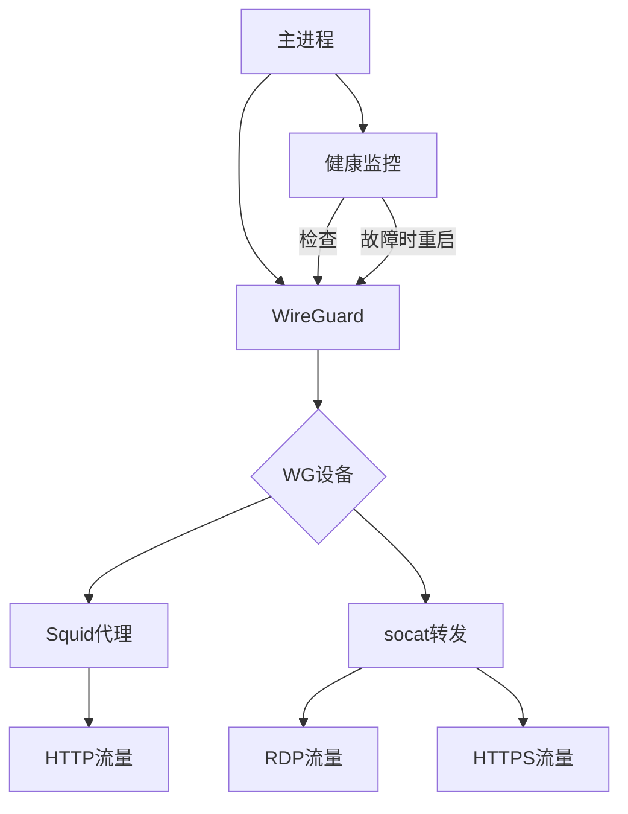

# WireGuard RDP & HTTP Proxy Docker Image
> Secure tunnel for RDP and HTTP traffic via WireGuard

将 WireGuard 打包成 Docker 镜像，支持通过 VPN 隧道进行：
1. HTTP/HTTPS 代理（Squid）
2. RDP 端口转发（socat）
3. HTTPS 端口转发（socat）

不必启动全局 VPN 代理，也可以将特定流量安全地路由到 VPN 网络。

## 功能特点
- HTTP/HTTPS 代理：通过 Squid 提供 HTTP/HTTPS 代理服务
- RDP 端口转发：通过 socat 转发 RDP 流量到目标服务器
- HTTPS 端口转发：通过 socat 转发 HTTPS 流量到目标服务器
- 自动重连：内置健康检查机制确保 VPN 连接稳定
- 轻量级：基于 [Ubuntu 22.04 的国内源替换镜像](https://github.com/nickdlkk/ubuntu)，仅包含必要组件
- 简单配置：挂载单个配置文件即可启动
- 高性能：WireGuard 提供比 OpenVPN 更高的性能和更低的延迟

## 快速开始

### 构建镜像

```bash
cd wg-proxy
docker build -t nickdlk/wireguard-rdp-http-proxy .
```

### 运行容器

```bash
docker run -d --name wg-proxy \
  --restart unless-stopped \
  --cap-add=NET_ADMIN \
  --sysctl net.ipv4.conf.all.src_valid_mark=1 \
  --sysctl net.ipv6.conf.all.disable_ipv6=0 \
  -p 18080:8000 \          # HTTP代理端口
  -p 13389:3389 \           # RDP代理端口
  -v /path/to/wireguard/configs:/etc/wireguard/config:ro \
  -e RDP_TARGET=10.8.0.100 \  # VPN网络内的目标RDP服务器IP
  nickdlk/wireguard-rdp-http-proxy:latest
```

**重要**: 
- 使用 `--sysctl` 参数而不是 `--privileged` 模式，更安全
- Windows路径格式: `"D:\\path\\to\\config:/etc/wireguard/config:ro"`

## 配置指南

### 必需配置

1. WireGuard 配置文件：
    - 将 WireGuard 配置文件（.conf）放入宿主机的 /path/to/wireguard/configs 目录
    - 容器将使用找到的第一个配置文件
    - 配置文件示例：
    ```ini
    [Interface]
    PrivateKey = <你的私钥>
    Address = 10.8.0.2/24
    DNS = 8.8.8.8
    
    [Peer]
    PublicKey = <服务器公钥>
    AllowedIPs = 10.8.0.0/24
    Endpoint = <服务器地址>:51820
    PersistentKeepalive = 25
    ```

2. RDP 目标设置：
    - 通过 RDP_TARGET 环境变量指定目标 RDP 服务器 IP
    - 示例: -e RDP_TARGET=192.168.1.5

3. HTTPS 目标设置：
    - 通过 HTTPS_TARGET 环境变量指定目标 HTTPS 服务器 IP
    - 示例: -e HTTPS_TARGET=192.168.1.5

### 可选配置

|环境变量|默认值|描述|
| ----- | ----- | ----- |
|SQUID_PORT|8000|HTTP 代理服务端口|
|RDP_PORT|3389|RDP 转发监听端口|
|HTTPS_PORT|443|HTTPS 转发监听端口|
|CHECK_INTERVAL|300|VPN 健康检查间隔(秒)|
|DEBUG|false|启用详细日志(true/false)|

### 端口说明

|容器端口|宿主机映射示例|服务|
| ----- | ----- | ----- |
|8000|-p 18080:8000|HTTP/HTTPS 代理|
|3389|-p 3389:3389|RDP 转发服务|
|443|-p 22443:443|HTTPS 转发服务|

## 使用示例

### 1. 使用 HTTP 代理

配置浏览器使用代理：
- 地址: 宿主机IP
- 端口: 18080 (或映射的端口)
- 类型: HTTP

测试代理：

```bash
curl --proxy http://localhost:18080 https://ipinfo.io/ip
```

### 2. 使用 RDP 转发

使用 RDP 客户端连接：
- 地址: 宿主机IP
- 端口: 3389 (或映射的端口)
- 流量将通过 VPN 隧道转发到 RDP_TARGET 指定的服务器

### 3. 使用 HTTPS 转发

直接连接到映射的端口：
- 地址: 宿主机IP
- 端口: 443 (或映射的端口，如22443)
- 流量将通过 VPN 隧道转发到 HTTPS_TARGET 指定的服务器

## 健康检查与自动恢复

容器内置健康检查机制：
1. 每 5 分钟检查 WireGuard 连接状态
2. 检测到 VPN 断开时自动重启服务
3. 确保服务长时间稳定运行

## 故障排查

### 容器内网络诊断

容器内置以下网络工具包，可用于诊断和调试网络连接：

| 命令 | 功能描述 | 所属软件包 | 使用示例 |
|------|----------|----------|----------|
| ping | 测试网络连通性 | iputils-ping | `ping 8.8.8.8` |
| ip | 查看/配置网络接口 | iproute2 | `ip addr show wg0` |
| **wg** | **WireGuard管理工具** | **wireguard-tools** | **详见下方WireGuard命令章节** |
| netstat | 查看网络连接状态 | net-tools | `netstat -tuln` |
| dig | DNS查询工具 | dnsutils | `dig google.com` |
| nslookup | DNS域名解析 | dnsutils | `nslookup google.com` |
| tcpdump | 网络抓包工具 | tcpdump | `tcpdump -i wg0` |
| curl | HTTP客户端工具 | curl | `curl --proxy http://localhost:8000 https://ipinfo.io/ip` |
| mtr  | 网络连通性和路由跟踪工具 | mtr | `mtr 8.8.8.8` |
| nmap | 网络扫描工具 | nmap | `nmap -sS 8.8.8.8` |

使用方法：
```bash
docker exec -it wg-proxy bash

# 示例：测试与目标服务器连通性
ping $RDP_TARGET

# 示例：查看WireGuard接口配置
ip addr show wg0
wg show

# 示例：检查代理服务状态
netstat -tuln | grep $SQUID_PORT
```

### WireGuard 命令详解

WireGuard 提供了强大的命令行工具来管理和监控VPN连接：

#### 基本命令

| 命令 | 功能 | 示例 |
|------|------|------|
| `wg show` | 显示所有接口状态 | `docker exec wg-proxy wg show` |
| `wg show <interface>` | 显示指定接口状态 | `docker exec wg-proxy wg show wg0` |
| `wg show interfaces` | 列出所有WireGuard接口 | `docker exec wg-proxy wg show interfaces` |
| `wg showconf <interface>` | 显示接口配置 | `docker exec wg-proxy wg showconf wg0` |

#### 详细状态查询

| 命令 | 功能 | 示例 |
|------|------|------|
| `wg show wg0 peers` | 显示所有peer | `docker exec wg-proxy wg show wg0 peers` |
| `wg show wg0 endpoints` | 显示peer端点 | `docker exec wg-proxy wg show wg0 endpoints` |
| `wg show wg0 allowed-ips` | 显示允许的IP | `docker exec wg-proxy wg show wg0 allowed-ips` |
| `wg show wg0 latest-handshakes` | 显示最近握手时间 | `docker exec wg-proxy wg show wg0 latest-handshakes` |
| `wg show wg0 transfer` | 显示数据传输统计 | `docker exec wg-proxy wg show wg0 transfer` |
| `wg show wg0 listen-port` | 显示监听端口 | `docker exec wg-proxy wg show wg0 listen-port` |
| `wg show wg0 fwmark` | 显示防火墙标记 | `docker exec wg-proxy wg show wg0 fwmark` |

#### 配置管理命令

| 命令 | 功能 | 用途 |
|------|------|------|
| `wg genkey` | 生成私钥 | 创建新的WireGuard配置 |
| `wg pubkey` | 从私钥生成公钥 | `echo <private_key> \| wg pubkey` |
| `wg genpsk` | 生成预共享密钥 | 增强安全性的可选密钥 |

#### 实用诊断示例

```bash
# 进入容器
docker exec -it wg-proxy bash

# 查看完整连接状态
wg show

# 查看数据传输情况
wg show wg0 transfer

# 查看最近握手时间（检查连接是否活跃）
wg show wg0 latest-handshakes

# 查看当前配置
wg showconf wg0

# 检查监听端口
wg show wg0 listen-port

# 查看所有peer的端点信息
wg show wg0 endpoints
```

#### 连接状态判断

- **正常连接**: `latest-handshakes` 显示最近时间戳
- **传输活跃**: `transfer` 显示数据收发统计
- **配置正确**: `endpoints` 显示正确的服务器地址
- **接口运行**: `wg show interfaces` 列出 wg0

#### WireGuard连接故障排查

如果WireGuard握手失败（`latest-handshakes` 显示0），按以下步骤排查：

**步骤1：检查基础连通性**
```bash
# 测试服务器IP连通性
docker exec wg-proxy ping -c 3 <服务器IP>

# 检查WireGuard接口状态
docker exec wg-proxy wg show
```

**步骤2：验证配置正确性**
```bash
# 查看当前配置
docker exec wg-proxy wg showconf wg0

# 检查endpoint是否正确
docker exec wg-proxy wg show wg0 endpoints
```

**步骤3：服务器端检查**
在VPN服务器上运行以下命令：
```bash
# 检查WireGuard服务状态
systemctl status wg-quick@wg0

# 查看服务器端配置
wg show

# 检查防火墙
ufw status
netstat -tuln | grep 51820
```

**步骤4：常见问题解决**
1. **握手失败**: 检查服务器端是否配置了客户端公钥
2. **DNS问题**: 使用IP地址替代域名endpoint
3. **端口阻塞**: 确保51820端口在服务器防火墙中开放
4. **resolvconf缺失**: 移除配置中的DNS行或安装resolvconf包

#### 深入诊断：握手未成功/无流量

当 `wg show` 看到 RX=0 或 `latest-handshakes` 为空/为0 时，继续执行以下检查：

1) 判定是否真的未握手/无流量

```bash
# 最近握手时间（为 0 或 never 表示未成功握手）
docker exec wg-proxy wg show wg0 latest-handshakes

# 传输统计（RX 一直为 0 表示未收到对端数据）
docker exec wg-proxy wg show wg0 transfer
```

2) 策略路由与路由表 51820（wg-quick 常用）

```bash
# 查看策略路由规则（应包含查找表 51820 的规则）
docker exec wg-proxy ip rule

# 查看表 51820 内容（通常包含经 wg0 的默认路由）
docker exec wg-proxy ip route show table 51820
```

3) 验证 UDP 可达性（服务器 51820/UDP 是否通）

```bash
# 使用 nmap 检查 UDP 端口可达性（需将 <ENDPOINT_IP> 替换为服务器IP）
docker exec wg-proxy nmap -sU -p 51820 <ENDPOINT_IP>

# 使用 mtr 的 UDP 模式观察路径
docker exec wg-proxy mtr -u -c 10 <ENDPOINT_IP>
```

4) 抓包确认是否有返回包（容器内）

```bash
# 观察请求和返回的 UDP 51820 流量（按 Ctrl+C 结束）
docker exec -it wg-proxy tcpdump -ni eth0 udp port 51820
```

5) 客户端配置建议（NAT 环境强烈建议）

- 在客户端配置的 `[Peer]` 段添加保活：

```ini
[Peer]
PublicKey = <服务器公钥>
Endpoint = <服务器IP或域名>:51820
AllowedIPs = 0.0.0.0/0,::/0
PersistentKeepalive = 25
```

- 若怀疑 DNS 解析问题，`Endpoint` 先用 IP 测试，排除 DNS 影响。
- 仅保留一个 `.conf`：本镜像会在挂载目录中选择“找到的第一个” `.conf` 文件作为配置。
  - 使用 docker-compose 建议仅挂载配置目录：`- "./config:/etc/wireguard/config:ro"`
  - 确保该目录内只有一个有效的 `.conf`，避免选择错误。

6) 服务器端（对端）配置核对

- 服务器的 `[Peer]` 必须包含客户端公钥，并将客户端隧道地址加入 `AllowedIPs`，示例：

```ini
[Peer]
PublicKey = <客户端公钥>
AllowedIPs = 10.10.10.5/32
```

- 确认服务器 51820/UDP 对公网开放（或已正确做端口转发），并放行防火墙。
- NAT/云防火墙均需放通 UDP 51820。

7) 成功判定（预期现象）

- `wg show wg0 latest-handshakes` 显示“几秒/几分钟前”。
- `wg show wg0 transfer` 中 RX/TX 均会随通信逐步增长。

#### 联网自检（不经 WireGuard）

将下方命令中的 <CONTAINER> 替换为你的容器名（示例：`wg-proxy` 或 `vpn`）。用于验证容器基础联网能力，与 WireGuard 无关。

```bash
# 1) 代理与 DNS
docker exec <CONTAINER> env | grep -i _proxy || true
docker exec <CONTAINER> cat /etc/resolv.conf
docker exec <CONTAINER> getent ahostsv4 example.com

# 2) HTTP/HTTPS 直连
docker exec <CONTAINER> bash -lc 'curl -I --max-time 8 https://www.cloudflare.com/cdn-cgi/trace || true'
docker exec <CONTAINER> bash -lc 'curl -I --max-time 8 http://connectivitycheck.gstatic.com/generate_204 || true'

# 3) 强制不走代理（验证直连能力/排除代理影响）
docker exec <CONTAINER> bash -lc 'curl -I --noproxy "*" --max-time 8 https://example.com || true'

# 4) 原生 TCP 测试（与 ping/证书无关）
docker exec <CONTAINER> bash -lc 'timeout 5 bash -c ":<>/dev/tcp/1.1.1.1/443" && echo OK || echo FAIL'

# 5) 路由与时间
docker exec <CONTAINER> ip route
docker exec <CONTAINER> date
```

判读要点：
- HTTP/HTTPS 200/204 与原生 TCP OK → 容器可直连外网。
- 仅 ping 失败不代表断网（ICMP 常被屏蔽）。
- 证书报错仅对直连 IP 常见（SNI/证书不匹配），不代表网络故障。

#### Docker Desktop/企业代理与 UDP 限制

多数 HTTP/HTTPS 代理不转发 UDP。若网络限制 UDP 出口，WireGuard 将无法握手。可用以下方法快速验证：

```bash
# 1) 公网 DNS（UDP53）直连测试：若超时，说明公网 UDP 受限
docker exec <CONTAINER> sh -lc 'dig +retry=1 +time=3 @8.8.8.8 -4 +short google.com || true'

# 2) 目标 WG 端口（示例 51820/UDP）探测
docker exec <CONTAINER> nmap -sU -Pn -p 51820 <ENDPOINT_IP> || true
docker exec <CONTAINER> nping --udp -p 51820 <ENDPOINT_IP> --count 3 || true

# 3) 抓包观察是否有返回包（Ctrl+C 结束）
docker exec -it <CONTAINER> tcpdump -ni eth0 udp port 51820
```

若 DNS/UDP 测试均失败，基本可判定当前出网路径不支持 UDP；WireGuard（基于 UDP）无法通过该路径建立隧道。

规避与改进：
- 尝试允许 UDP 的网络（家庭/移动热点）。
- 让 WG 服务器兼容常见放行端口（如 UDP/443）；若网络“全局禁 UDP”，此法也无效。
- 退而求其次，使用基于 TCP 的 VPN（如 OpenVPN TCP/443）或 UDP-over-TCP 封装（需自建，镜像未内置）。
- 临时绕过以验证外网：`docker exec <CONTAINER> wg-quick down wg0`（测试完 `wg-quick up wg0` 还原）。
- 避免黑洞：将 `[Peer]` 的 `AllowedIPs` 修改为内网网段而非 `0.0.0.0/0, ::/0`，以便 WG 未通时普通外网仍走 `eth0`。
- 仅挂载配置目录：在 compose 中用 `- ./config:/etc/wireguard/config:ro`，避免找到错误的 `.conf`。

**推荐启动命令**
```bash
# 使用正确的启动参数（推荐使用--sysctl）
docker run -d --name wg-proxy \
  --restart unless-stopped \
  --cap-add=NET_ADMIN \
  --sysctl net.ipv4.conf.all.src_valid_mark=1 \
  --sysctl net.ipv6.conf.all.disable_ipv6=0 \
  -p 18080:8000 \
  -p 13389:3389 \
  -p 22443:443 \
  -v "D:\\path\\to\\config:/etc/wireguard/config:ro" \
  -e RDP_TARGET=10.8.0.100 \
  -e HTTPS_TARGET=10.8.0.100 \
  nickdlk/wireguard-rdp-http-proxy:latest
```

### 常见问题解决

1. **配置文件挂载问题 (Windows)**：
    - 使用正确的Windows路径格式：
    ```bash
    # 正确格式
    -v "D:\\path\\to\\config:/etc/wireguard/config:ro"
    
    # 或使用相对路径
    -v "$(pwd)/config:/etc/wireguard/config:ro"
    ```

2. **WireGuard 权限问题**：
    - 推荐使用sysctl参数而不是privileged模式：
    ```bash
    docker run --cap-add=NET_ADMIN \
      --sysctl net.ipv4.conf.all.src_valid_mark=1 \
      --sysctl net.ipv6.conf.all.disable_ipv6=0 ...
    ```
    - 如果仍有问题，可尝试privileged模式（不推荐）：`--privileged`

3. **WireGuard 连接状态检查**：
    ```bash
    # 检查隧道是否建立
    docker exec wg-proxy wg show
    
    # 检查接口配置
    docker exec wg-proxy ip addr show wg0
    
    # 检查路由表
    docker exec wg-proxy ip route show
    ```

4. **网关连通性测试**：
    ```bash
    # 测试VPN网关连通性
    docker exec wg-proxy ping 10.10.10.1
    
    # 测试目标RDP服务器
    docker exec wg-proxy ping $RDP_TARGET
    ```

5. **容器日志分析**：
    ```bash
    # 查看详细启动日志
    docker logs wg-proxy
    
    # 实时查看日志
    docker logs -f wg-proxy
    ```

### 测试结果参考

最新完整测试结果总结（2024年测试验证）：
- ✅ 容器构建成功
- ✅ WireGuard配置文件正确加载
- ✅ WireGuard隧道成功建立
- ✅ 与VPN服务器建立peer连接
- ✅ 网关连通性测试通过 (10.10.10.1)
- ✅ 内网服务器连通性测试通过 (192.168.3.34)
- ✅ HTTP代理服务正常运行 (端口8000)
- ✅ RDP转发服务正常运行 (端口3389)
- ✅ HTTPS转发服务正常运行 (端口443)

**配置要点**：
- 使用IP地址代替域名endpoint解决DNS问题
- 使用`--sysctl`参数而不是`--privileged`提供安全性
- Windows路径挂载使用双反斜杠格式
- 服务器端需正确配置客户端公钥

6. **其他常见问题**：
    - 检查配置文件格式是否正确
    - 验证密钥配置是否正确  
    - 确认服务器端配置允许连接
    - 检查容器是否正常运行: `docker ps`
    - 确认端口映射是否正确
    - 确保防火墙允许宿主机端口访问

## 实现原理
### 容器内部架构



### 核心组件
1. WireGuard:
    - 建立 VPN 隧道
    - 使用第一个找到的配置文件
    - 支持自动重连和健康检查
    - 高性能内核级加密

2. Squid:
    - 提供 HTTP/HTTPS 代理
    - 禁用缓存减少资源占用
    - 支持 HTTPS CONNECT 隧道

3. socat:
    - TCP 端口转发
    - 绑定 WireGuard 接口 IP
    - 支持多连接复用
    - 支持 RDP 和 HTTPS 流量转发

## 维护与更新

### 定时重启建议

通过宿主机 crontab 定期重启容器解决潜在连接问题：
```bash
# 每 6 小时重启一次
0 */6 * * * docker restart wg-proxy
```

### 版本更新
1. 拉取最新镜像：
```bash
docker pull nickdlk/wireguard-rdp-http-proxy:latest
```
2. 重启容器：
```bash
docker stop wg-proxy
docker rm wg-proxy
# 使用原始 run 命令重新创建容器
```

## 与 OpenVPN 版本对比

| 特性 | WireGuard 版本 | OpenVPN 版本 |
|------|---------------|--------------|
| 性能 | 更高，内核级加密 | 较低，用户态加密 |
| 延迟 | 更低 | 较高 |
| 配置 | 简单，单文件 | 复杂，多文件可能 |
| 连接建立 | 快速 | 较慢 |
| 加密算法 | 现代加密算法 | 可配置多种算法 |
| 移动性 | 更好 | 一般 |

# 参考

WireGuard 官方文档: https://www.wireguard.com/
WireGuard 安装指南: https://www.wireguard.com/install/
